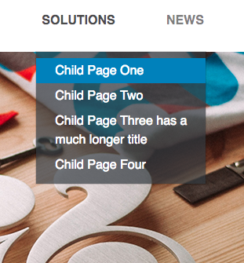
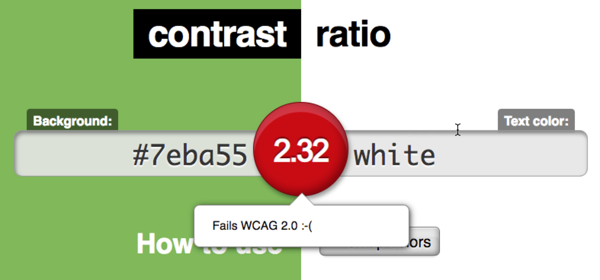
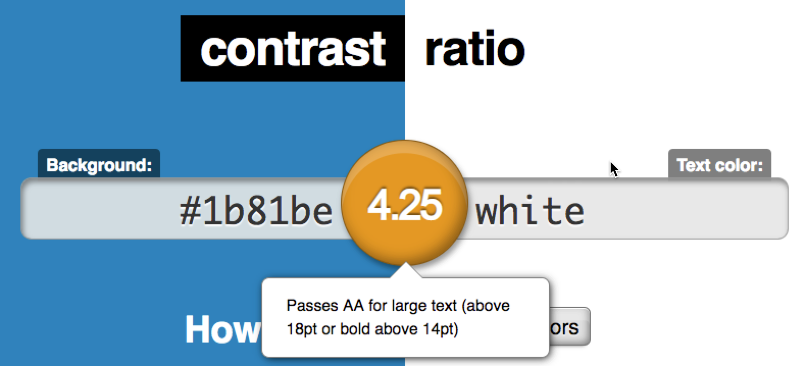

# iModules Test Build

Thank you for giving me the opportunity to complete this test build!

I decided to use Twitter Bootstrap because it's the CSS library with which I'm the most familiar, and also because it's the most prominent CSS framework used. Although a lot of functionality can be handled with Bootstrap, I felt the need to use media queries to manage certain situations.

The examples didn't show what color, if any, to use when hovering over the dropdown menu items under the "SOLUTIONS" menu item. I felt like the most logical colors to use were either the hue of green that is used in the examples or the hue of blue. I decided on blue and I'll explain why.

Accessibility is the reason I chose this hue of blue.
> "AA compliance requires text and images of text to have a minimum color contrast ratio of 4.5:1. In other words, the lighter color in a pair must have four-and-a-half times as much luminance (an indicator of how bright a color will appear) as the darker color."

Web Content Accessibility Guildlines 2.0 ([WCAG](https://www.w3.org/WAI/standards-guidelines/wcag/))

   

       
Although the blue doesn't quite meet the 4.5:1 contrast ratio, it provides better accessibility for users with disabilities.
